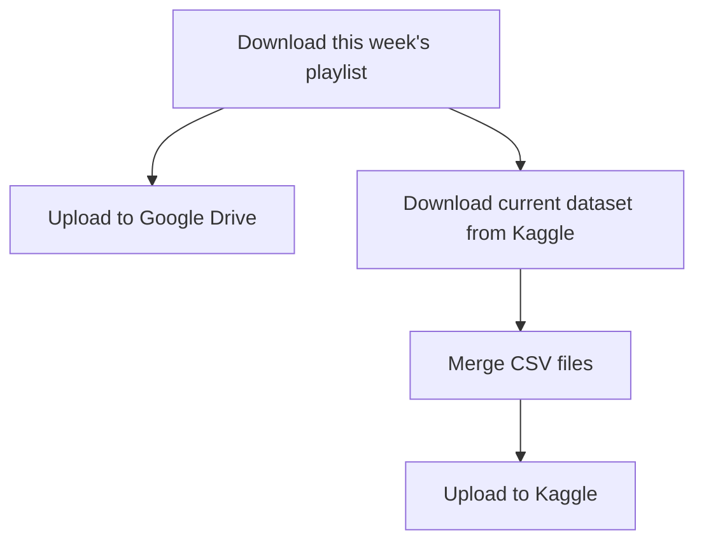

# Upload Spotify's "Discover Weekly" playlist to Kaggle and Google Drive

This project uses GitHub Actions to upload Spotify's "Discover Weekly" playlist to Kaggle and Google Drive.

```mermaid
flowchart TD
    A[Download this week's playlist] --> B[Upload to Google Drive]
    A --> C[Download current dataset from Kaggle]
    C --> D[Merge CSV files]
    D --> E[Upload to Kaggle]
```